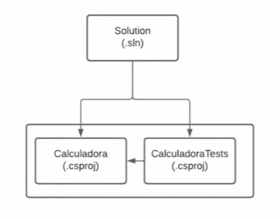
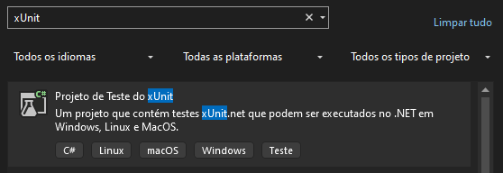
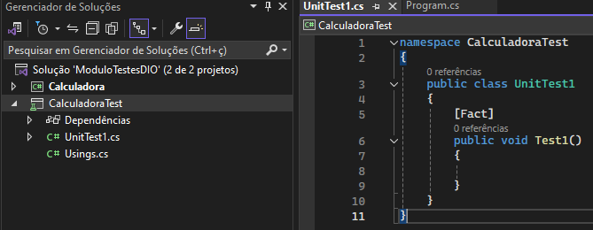
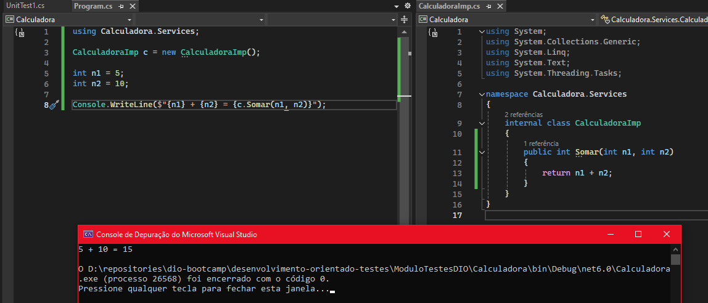
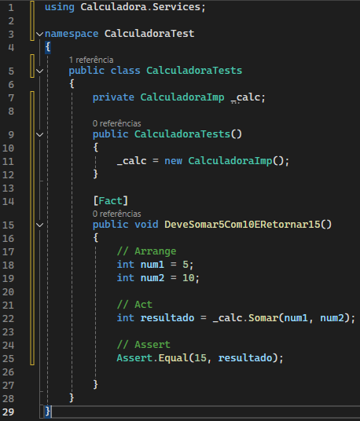
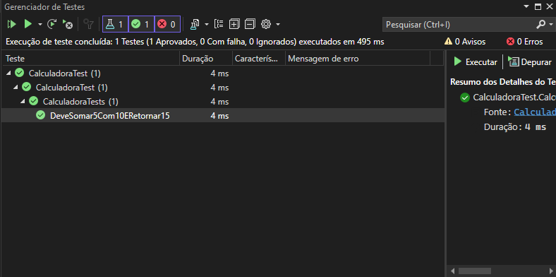
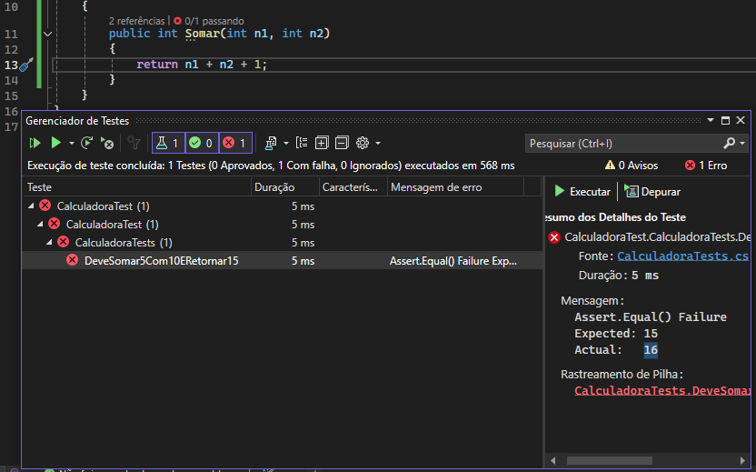
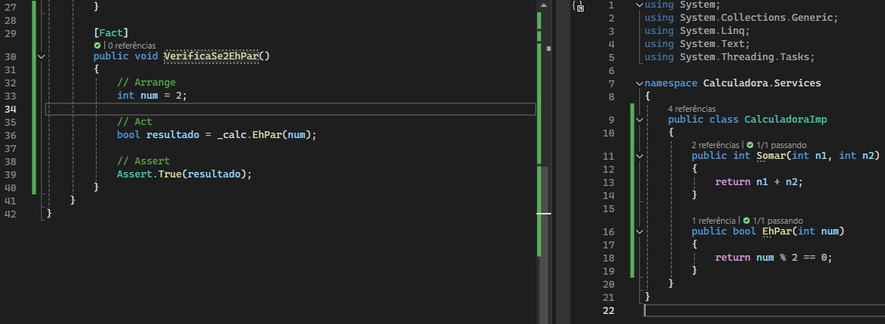
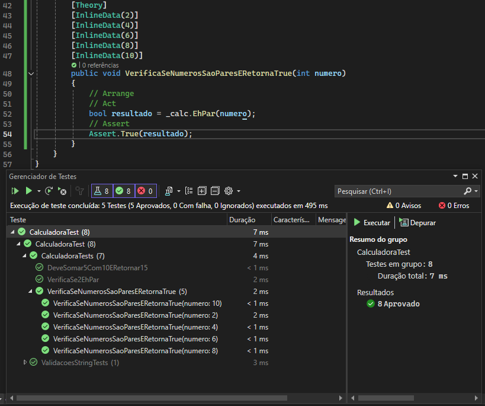

<!-- TOC start (generated with https://github.com/derlin/bitdowntoc) -->

- [Trabalhando com Desenvolvimento Orientado a Testes](#trabalhando-com-desenvolvimento-orientado-a-testes)
   * [Testes de software](#testes-de-software)
      + [Testes únitários](#testes-únitários)
      + [Frameworks de teste](#frameworks-de-teste)
   * [Teste de software na prática](#teste-de-software-na-prática)
      + [Criando um Projeto com xUnit](#criando-um-projeto-com-xunit)
      + [Criando um cenário de teste](#criando-um-cenário-de-teste)
         - [Criando classe de teste](#criando-classe-de-teste)
      + [Theory](#theory)

<!-- TOC end -->

# Trabalhando com Desenvolvimento Orientado a Testes

---

## Testes de software

Existem vários tipos de testes de software: unitários, integração, regressivo segurança, etc.
Os testes são fundamentais para garantir a qualidade e o correto funcionamento de um software.
Serve principalmente para validar se o que foi construído está atendendo ao que se é esperado.

### Testes únitários

Teste unitário (ou teste de unidade) são testes  realizados diretamente no código fonte, buscando testar a menor unidade de código possível, através de cenários que podem ocorrer no sistema.

Exemplo: Um usuário do sistema só é __cadastrado__ se possuir um __CPF__ e um __e-mail válido__. Caso contrário, retornará um erro indicando o que está errado.

Possíveis casos de teste:
* Usuário com todos os dados válidos
* Usuário com CPF inválido
* Usuário com e-mail inválido

### Frameworks de teste

Quando falamos em testes, estamos escrevendo códigos para validar o nosso código. Para isso temos diversos frameworks para auxiliar nesse processo.

Uma solução possui em sua estrutura o projeto principal e o seu projeto de teste. Na imagem acima podemos observar que nosso projeto Calculadora possui um projeto de teste CalculadoraTest que conhece nosso projeto principal.

Alguns frameworks de teste:
* MSTest
* NUnit
* xUnit

## Teste de software na prática

### Criando um Projeto com xUnit

1. Crie um projeto de console no VisualStudio
2. A solução deverá ficar fora da pasta do projeto como padrão
3. Crie o projeto Calculadora

4. Clique com o botão direito na solução
5. Navegue até __adicionar__ e clique em __novo projeto__

6. Procure por xUnit

7. Crie um novo projeto CalculadoraTest

8. Clique com o botão direito no projeto CalculadoraTest
9. Navegue até __adicionar__ e __referência de projeto__

10. Selecione o projeto Calculadora e clique em OK

### Criando um cenário de teste

Após a implementação da classe calculadora, vamos implementar um cenário de teste para este software.

Podemos pensar que por se tratar de um programa pequeno, não há necessidade de implementação de teste pois podemos identificar facilmente se o retorno da função está relmente retornando o resultado esperado, porém, imagine que estamos lidando com um código com mais de 1000 linhas e em alguma dessas linhas há um bug que retorna um resultado inesperado. É aí que surge a necessidade de um teste unitário.
Como podemos obervar, o software que escrevemos deve receber os valores e esperamos um determinado valor de retorno.

#### Criando classe de teste

Em nosso projeto CalculadoraTest, temos um arquivo chamado `UnitTest1.cs` criado por padrão. Vamos renomeá-lo para utilizar como nosso primeiro teste.
*Para cada classe presente em nosso projeto principal, devemos criar uma nova classe de teste em nosso projeto xUnit.*

Testes devem ter seu funcionamento bem claro para que outros desenvolvedores entendam claramente o que este teste faz.
Para implementar um teste precisamos entender 3 conceitos:
1. __Arrange:__
É o conceito de montar um cenário de teste. No caso de uma soma entre 5+10, precisamos disponibilizar estes números para o teste.
2. __Act:__
Após preparar o cenário, vamos agir, ou seja, executar a ação de somar.
3. __Assert:__
Por fim nós validamos o nosso cenário, que neste caso é somar e retornar o valor 15 como esperado.

No código acima renomeamos o arquivo para `CalculadoraTests` e implementamos um construtor para receber a classe `CalculadoraImp.cs` do nosso projeto principal.
No método `DeveSomar5Com10ERetornar15()` implementamos os 3 conceitos para que nosso teste seja feito.
Por fim temos `Assert.Equal()` que se trata do método responsável por validar se nosso teste teve sucesso. Tal método recebe dois parâmetros, sendo o primeiro deles o resultado esperado e o segundo o resultado obtido pelo teste. Portanto se o valor for igual a 15, vai retornar que o teste foi bem sucedido.

Se formos até a aba superior __Teste__ e clicar em __Executar todos os testes__, será aberto o Gerenciador de Testes e podemos observar se o teste foi bem sucedido ou não.

Note que se induzirmos um bug no método de soma, o gerenciador de testes vai retornar que o teste falhou e podemos ver em `Mensagem` que o resultado esperado é 15 mas o retorno atual é 16.

### Theory

Vamos supor que criamos um método que verifica se um número é par e para isso escrevemos um teste para ele.

Mas queremos verificar se outros números  além  de 2 são par também. Para isso teriamos que escrever um teste para cada número que desejamos validar.
Para evitar a duplicação de código utilizamos o conceito de Theory.

Com o Theory podemos verificar vários cenários em um único código.
Para isso precisamos mudar de `[Fact]` para `[Theory]` e logo abaixo adicionar em `[InlineData()]` os valores dos quais queremos validar.
O que muda no teste agora é que ele recebe um parâmetro e não há mais a necessidade da criação de uma variável de valor dentro do método, dispensando o uso do Arrange neste caso.
Podemos observar agora que temos 5 testes derivados do mesmo teste `VerificaSeNumerosSaoParesERetornaTrue(int numero)`.

Podemos refatorar esse teste para que ele receba um array de inteiros e dessas forma realizar o teste com uma lista de números, tornando o código ainda mais fácil de ser entendido.