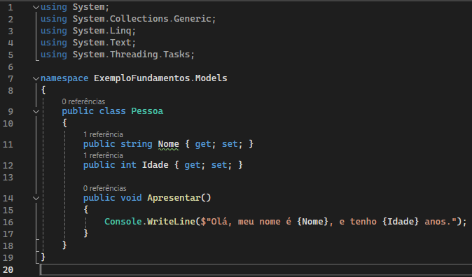

# .NET
É uma plataforma de desenvolvimento que utiliza a linguagem C# para desenvolvimento multiplataforma.

## Versões
* [Veja a linha do tempo do .NET](https://time.graphics/line/291016)
* Atualmente a plataforma .NET está em sua versão o [.NET 8](https://dotnet.microsoft.com/pt-br/download/dotnet/7.0)
* .NET Framework é a versão legada do .NET

## Classes
As classes são a estrutura mais básica de um projeto orientado a objeto. Ela parte da abstração que representa características de um objeto no mundo real

#### Exemplo de classe em .NET

| Sintaxe | Significado |
|---|---|
| `public class Pessoa` | Declaração de inicialização da classe dentro do projeto |
| `public string Nome { get; set; }` | Propriedade de inicialização de uma variável string dentro da classe |
| `{ get; set; }` | Define o comportamento desta variável na inicialização do objeto |
| `public void Apresentar()` | Método da classe
| `namespace ExemploFundamenos.Models` | Caminho lógico das classes dentro do projeto

#### namespaces
Os namespaces representam o caminho lógico da classe e deve ser declarado no código do programa para que as classes desenvolvidas possam ser utilizadas.

`using ExemploFundamentos.Models` vai definir o caminho lógico de onde as classes estão salvas para assim poderem ser usadas no software.

`Models` representa a pasta ou pacote em que a classe está salva.

#### Tipos em C#

| Tipo | Representação | Valores suportados | Valor Padrão |
|---|---|---|---|
| string | Uma série de caracteres | --- | --- |
| char | Uma única caractere Unicode | --- | --- |
| object | Tipo objeto | --- | --- |
| bool | Valor booleano | True ou False | False |
| byte | Inteiro de 8-bit sem assinatura | 0 a 255 | 0 |
| decimal | Valores decimais na casa de 28-29 dígitos | (+ ou -)1.0 x 10e-28 até 10e28 | 0.0M |
| double | Valor flutuante de 64 bit com dupla precisão | (+/-)5.0 x 10 elevado a -324 até (+/-)1.7 x 10 elevado a 308 | 0.0M
| int | Valor inteiro de 32 bit | -2,147,483,648 até 2,147,483,647 | 0 |
| float | Valor de ponto flutuante 32 bit de unica precisão | -3.4 x 10 elevado a 38 até + 3.4 x 10 elevado a 38 | 0.0F |
| long | Valor inteiro 64 bit | -9,223,372,036,854,775,808 até 9,223,372,036,854,775,807 | 0L |
| uint | Valor inteiro 32 bit somente positivo | 0 até 4,294,967,295 | 0 |
| short | Valor inteiro 16 bit | -32,768 até 32,767 | 0 |
| ulong | Valor inteiro 64 bit somente positivo | 0 até 18,446,744,073,709,551,615 | 0 |