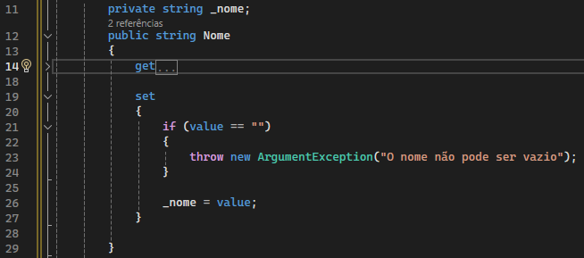

# Manipulação de Dados e Objetos com .NET

---

## Propriedades
As propriedades estão relacionada a abstração de valores para ler, gravar ou calcular valores de campos. 
Propriedades ajudam de maneira flexivel que as classes tenham tratamento de erros, evitando que o usuário insira dados inesperados para a operação.

### Propriedades de uma classe

No exemplo acima, a classe Pessoa possui duas propriedades, Nome e Idade seguidas de `{ get; set; }` após a declaração.

### Métodos de uma classe

Métodos da classe é uma forma de escrever funções.
Os métodos de uma classe podem ser públicos ou privados dela.

### Validações GET e SET
As validações servem para evitar que sejam passados valores inesperados para uma variável.

#### Criando uma validação

Para que uma validação seja feita, é preciso a declaração de uma variável *__privada__* do mesmo *__tipo__* da propriedade.
Dentro da propriedade __*Nome*__ será declarada as validações necessárias e a propriedade atribuirá o valor á variável privada `_nome`.

#### Validação GET

O exemplo acima indica que a propriedade __*Nome*__ receberá sempre os valores em maiúsculo por meio do método `.ToUpper()`.
Portanto todo valor recebido por essa propriedade passará por um tratamento antes de ser setado.

#### Validação SET

O exemplo acima indica que a propriedade __*Nome*__ não pode atribuir uma string vazia, caso receba, a palavra reservada `throw` vai exibir uma mensagem de erro por meio da classe `ArgumentException()` e não vai executar o restante do código.

