# Programação de APIs com Banco de Dados

## Banco de dados

Um banco de dados é uma coleção organizada de informações (ou dados) estruturadas, normalmente armazenadas eletronicamente em um sistema de computador.

### Tipos de banco de dados

#### Banco de dados relacional

O tipo mais usado atualmente, armazenando dados estruturados, sendo organizado em tabelas, com colunas e linhas, que se relacionam entre si.

A escolha do banco de dados depende diretamente de sua aplicação.
O MySQL é uma solução gratuita que comporta um pequeno volume de acessos, o que faz dele uma solução ideal para pequenas aplicações individuais, porém, quando precisamos de algo mais robusto como um sistema de um hospital do qual não pode haver indisponibilidade, o uso do Oracle ou SQL Server é mais indicado.

##### Tabelas
São dados estruturados e organizados logicamente em formato de linha e coluna.

Assim como uma tabela de excel, tabelas de banco de dados são estruturadas em colunas e linhas. Suas colunas indicam seu tipo de dado e as linhas são o dado em si.
Na imagem acima temos uma relação entre a tabela de endereços na coluna `IdCliente` que se relaciona com a tabela de clientes por meio da coluna `Id`.

#### Banco de dados não relacional
Banco de dados onde os dados não são armazenados em tabela e sim armazenados de maneira não estruturada ou semi-estruturada.

O mongoDB é o banco de dados não relacional mais utilizado e existem vários tipos, sendo alguns deles o document databases(mongoDB), key-value databases, wide-column stores e graph databases.
Um banco de dados relacional tem uma estrutura rígida de armazenamento de dados. Se uma coluna é definida como booleana, ela não pode receber valores inteiros ou de texto por exemplo.

##### Dados semi estruturados
Os banco de dados não relacionais podem utilizar dados semi estruturados para armazenar seus dados.

Neste exemplo temos um arquivo JSON que pode ser uma das estruturas de dados utilizadas em um banco de dados não relacional.
Diferente do banco de dados relacional, a estrutura pode ser variável, contendo dados diferentes e de tipos diferentes.

### Database Management System (DBMS)
É um software utilizado para acessar, manipular e monitorar um sistema de banco de dados.

Um banco de dados funciona de forma stand alone, porém, para que você desenvolvedor manipule o banco de dados, é necessário um software que funciona de forma parecida com uma IDE, mas que é voltada a manipulação de um banco de dados. No caso do SQL server, temos o SQL Server Management Studio.

### Instalação e configuração

#### Instalando SQL server Express

1.  Acesse o site para download do [SQL Server](https://www.microsoft.com/pt-br/sql-server/sql-server-downloads)
2. Procure pela __Edição especializada gratuita__
3. Baixe a versão __Express__
4. Selecione a versão Básica e siga os passos até o fim da instalação

Ao final da instalação será exibida informações úteis para manipulação do banco de dados com o DBMS.
A informação de `CADEIA DE CONEXÃO` será a informação utilizada para conexão com o banco de dados.

#### Configurando SQL server

1. Abra o SQL Server Configuration Manager
2. Na aba esquerda, clique em __SQL Server Services__
3. Note que o __SQL Server (SQLEXPRESS)__ está como running
Isso quer dizer que seu servidor está rodando
4. Clique duas vezes em __SQL Server (SQLEXPRESS)__
5. Na aba __Serviços__ troque o __Modo inicial__ para manual
Isso vai te dar controle sobre o estado do banco de dados

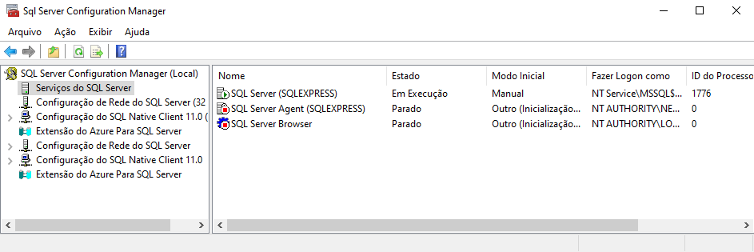

#### Instalando Server Management Studio (SSMS)

1. Acesse o site para download do [SSMS](https://learn.microsoft.com/pt-br/sql/ssms/download-sql-server-management-studio-ssms?view=sql-server-ver16)
2. Vá a até a sessão __Baixar o SSMS__
3. Clique em __Baixar o SSMS (SQL Server Management Studio)__
4. Siga os passos do instalador

#### Configurando SSMS

1. Em __Tipo de servidor__ utilize o Mecanismo de Banco de Dados
2. Em __Nome do servidor__ troque para `localhost\sqlexpress`
Que foi o SQL server que instalamos anteriormente
3. Em __Autenticação__ podemos utilizar a Autenticação do Windows padrão
*Caso precise acessar de maneira externa será necessário utilizar a __Autenticação do SQL Server__ com login e senha*
4. Em __Criptografia__ troque para Opcional

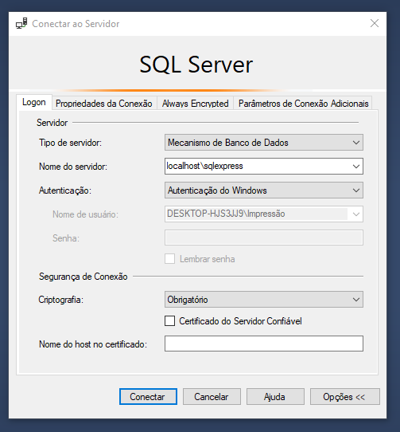

---

## Structured Query Language (SQL)

É a linguagem de banco de dados usada para consulta e manipulação de dados. A linguagem SQL na maioria dos casos é utilizada em todos os bancos de dados, portanto, aprendendo em um banco de dados, será possível utilizar este conhecimento em todos os outros.

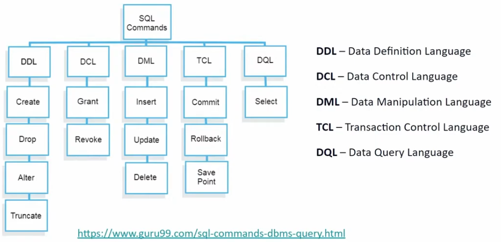

### Banco de dados
É uma coleção de dads estruturados, agrupados de forma concisa. É composto de tabelas, procedures, views, etc.
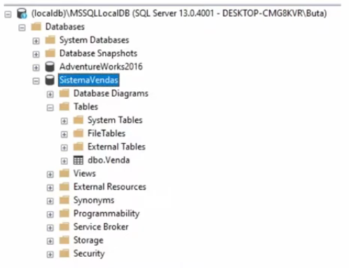
Um banco de dados pode conter vários databases destinado a vários sistemas. Eles separam as tabelas de dados para que possam ser acessados de diferentes aplicações, além de especificar o banco que a aplicação irá trabalhar, será necessário especificar também qual database será acessado.

#### Criando um Banco de dados

1. No SSMS, clique com o botão direito do mouse em __Banco de dados__

2. Clique em __Novo banco de dados__

3. Dê um nome para o Banco de dados e clique em OK
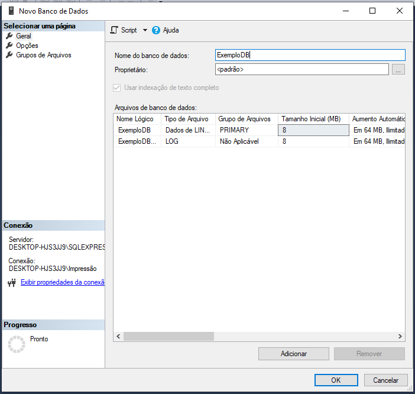

##### ID
Todo dado dentro de um banco de dados tem um ID único, que garante que cada dado inserido dentro do banco de dados seja único.

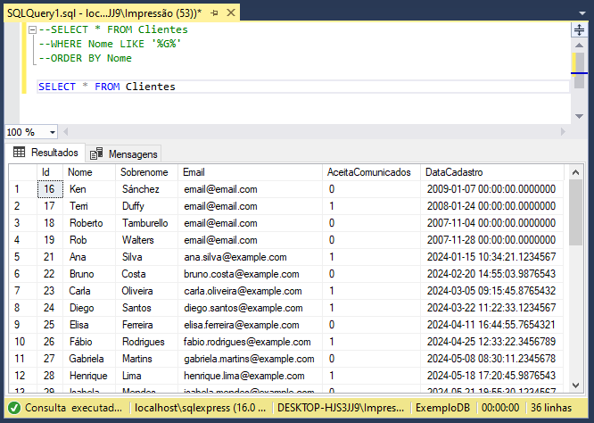
Note que mesmo que façamos a remoção de um dado e inserirmos ele normamente, ele não será o mesmo ID, pois este é incrementado sempre que um novo dado é inserido no banco de dados.

#### Fazendo uma consulta
Ao selecionar um database podemos abrir uma __Nova Consulta__.
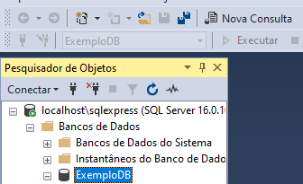

Fique atento para qual banco de dados sua consulta está apontando.

Sempre que se conectar novamente ao banco de dados, a Query pode estar apontando para a master, então ocorrerá um erro caso você faça uma nova consulta. Portanto atente-se para onde a sua query está apontando sempre que se conectar ao Banco de dados.

##### SELECT
O comando `SELECT` servirá para selecionar uma tabela do banco de dados. Desse modo será feita uma consulta pela tabela especificada após o comando `FROM`. O `*` Representa todas as colunas da tabela.

Ao executar o comando digitado, será exibida uma *Result Grid* com o conteúdo da tabela.

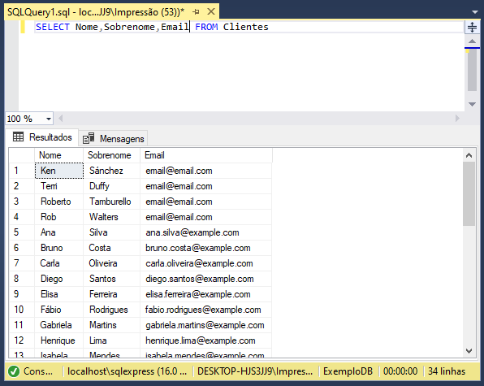
Para selecionar colunas específicas do banco de dados, no lugar do `*` especifique o nome das colunas que deseja selecionar.

##### ORDER BY

O comando `ORDER BY` é responsável por ordenar a tabela em ordem crescente por padrão.

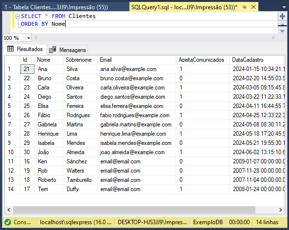

Podemos também utilizar o comando `DESC` para ordenar a tabela por ordem descrescente.

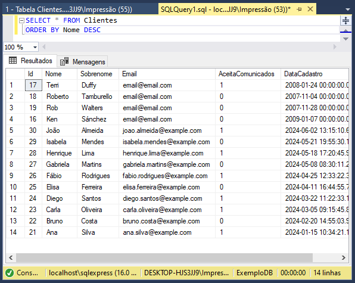

Também é possível ordenar através de várias colunas, colocando as colunas desejadas separadas por vírgula.

Com este comando será ordenada a coluna de nome por ordem crescente e a coluna sobrenome logo em seguida. Neste exemplo ele ordenará os sobrenomes na ordem crescente após ordenar os nomes, no caso de existirem nomes repetidos.

##### WHERE
Em alguns casos queremos que sejam exibidos apenas dados específicos, para isso utilizamos a clausula `WHERE`.

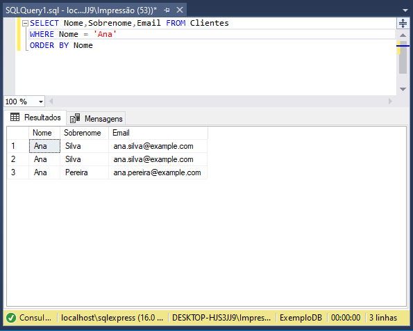
No exemplo acima filtramos o nome Ana e ele trouxe somente o nome especificado na coluna Nome. __*Em SQL sempre será utilizado áspas simples para escrever strings.*__

###### AND e OR

Caso seja necessário mais de um filtro, a clausua `AND` é utilizada para declarar uma outra coluna da qual o filtro obterá informações.

Assim como na lógica de programação o `OR` também pode ser utilizado.

###### LIKE

Quando precisamos que a pesquisa seja não somente de um nome específico, mas sim de um nome que comece com uma letra específica, utilizamos o `LIKE` no lugar do `=`, que irá procurar por dados que comecem com a letra especificada.
O sinal de `%` após a letra significa que o filtro especificado trará somente o que começa com a letra G ignorando o que vier após ela. Utilizando o sinal `%` antes e depois desta forma `%G%`, será mostrado qualquer dado que contenha a letra G independente da localização dentro da string.

##### INSERT

Quando queremos inserir dados numa tabela utilizamos o comando `INSERT INTO` especificando a tabela logo em seguida e as colunas a serem inseridas. Após o comando `INSERT` devemos especificar o valor a ser inserido com `VALUES` especificando entre `()` os valores a serem inseridos __na ordem especificada anteriormente__.
O comando `GETDATE()` é uma função que captura a data atual. O banco de dados por se tratar de uma tabela estruturada, não aceitará que você insira um dado que não obedece a especificação dada no momento de sua criação, portanto, __*caso você tente inserir um dado que não seja o esperado, o banco retornará um erro.*__

Também podemos inserir os valores diretamente omitindo a declaração das colunas, porém, __*será necessário obedecer a ordem correta das colunas*__. É util para resumir a declaração de inserção no banco de dados.

##### UPDATE
Quando precisamos fazer uma atualização, como a mundança de um email no banco de dados, utilizamos o comando `UPDATE`. Este comando atualiza a informação desejada através da clausula `SET`.

__*É muito importante que seja feita a atualização pelo `id`, pois sem ele você poderá alterar dados que não correspondem ao dado requisitado. Caso não fosse declarado o `WHERE` nesta atualização, as duas linhas com nome `Rodrigo` teriam seu email atualizado.*__

###### JAMAIS FAÇA UM UPDATE SEM WHERE

##### DELETE

Quando precisamos deletar um dado de uma tabela, utilizamos o comando `DELETE` seguido do `WHERE` para especificar o que será deletado.

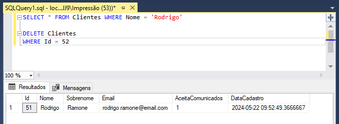
No exemplo acima deletamos o dado de id 52 que correspondia ao mesmo dado de id 51. Neste caso tinhamos um dado duplicado.

###### JAMAIS FAÇA UM DELETE SEM WHERE

#### Criando uma tabela

A criação de uma tabela pode ser feita utilizando o comando `CREATE TABLE` e em seguida declarando seu nome e tipos de dados de irão conter na tabela.

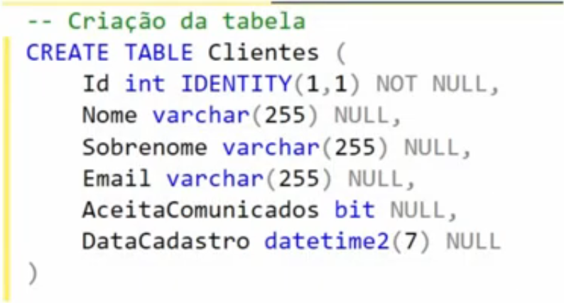
Note que nos campos onde criamos as colunas, primeiro inserimos o nome da coluna, o seu tipo e entre `()` está o tamanho daquele campo.

##### PRIMARY KEY

A clausula `PRIMARY KEY` vai garantir que o campo será único.

No exemplo acima especificamos que o campo Id terá sempre um valor único.

##### IDENTITY

A clausula `IDENTITY` é onde especificamos que este campo será gerenciado pelo próprio banco de dados. Toda tabela deve ter uma coluna de Id, mas ela não é obrigatória ao inserir dados na tabela.

Entre `()` colocamos o valor inicial e qual será o incremento deste campo. Neste caso ele se inicia em 1 e incrementa uma inidade a cada campo adicionado.

##### NULL e NOT NULL

As clausulas `NULL` e `NOT NULL` servem como validações indicando que aquele campo é ou não obrigatório.

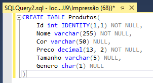
No exemplo acima temos os campos `Cor`, `Tamanho` e `Genero` que podem receber valores vazios no momento da inserção destes dados, caso algum destes não sejam conhecidos no momento de sua insenção no banco de dados.

#### Tipos de Dados SQL Server

##### Tipos de Dados numéricos

| Tipo de Dados   | Descrição |
|-----------------|------------|
| `bit`           | Pode armazenar 1, 0 ou NULL. |
| `tinyint`       | Armazena números inteiros de 0 a 255. |
| `smallint`      | Armazena números inteiros de -32.768 a 32.767. |
| `int`           | Armazena números inteiros de -2.147.483.648 a 2.147.483.647. |
| `bigint`        | Armazena números inteiros de -9.223.372.036.854.775.808 a 9.223.372.036.854.775.807. |
| `decimal(p,s)`  | Armazena números fixos e flutuantes. A precisão (p) pode ser de 1 a 38 e a escala (s) de 0 a p. |
| `numeric(p,s)`  | Funcionalmente igual ao `decimal`. |
| `smallmoney`    | Armazena valores monetários de -214.748,3648 a 214.748,3647. |
| `money`         | Armazena valores monetários de -922.337.203.685.477,5808 a 922.337.203.685.477,5807. |
| `float(n)`      | Armazena números flutuantes. O número de bits n define a precisão. |
| `real`          | Armazena números flutuantes com precisão de 7 dígitos decimais. |

##### Tipos de Dados de Cadeia de Caracteres

| Tipo de Dados   | Descrição |
|-----------------|------------|
| `char(n)`       | Armazena uma cadeia de caracteres de comprimento fixo. n pode ser de 1 a 8.000. |
| `varchar(n)`    | Armazena uma cadeia de caracteres de comprimento variável. n pode ser de 1 a 8.000. |
| `varchar(max)`  | Armazena uma cadeia de caracteres de comprimento variável. Máximo de 2^31-1 caracteres. |
| `text`          | Armazena uma cadeia de caracteres de comprimento variável. Máximo de 2.147.483.647 caracteres. |

##### Tipos de Dados de Cadeia de Caracteres Unicode

| Tipo de Dados   | Descrição |
|-----------------|------------|
| `nchar(n)`      | Armazena uma cadeia de caracteres Unicode de comprimento fixo. n pode ser de 1 a 4.000. |
| `nvarchar(n)`   | Armazena uma cadeia de caracteres Unicode de comprimento variável. n pode ser de 1 a 4.000. |
| `nvarchar(max)` | Armazena uma cadeia de caracteres Unicode de comprimento variável. Máximo de 2^31-1 caracteres. |
| `ntext`         | Armazena uma cadeia de caracteres Unicode de comprimento variável. Máximo de 1.073.741.823 caracteres. |

##### Tipos de Dados Binários

| Tipo de Dados   | Descrição |
|-----------------|------------|
| `binary(n)`     | Armazena dados binários de comprimento fixo. n pode ser de 1 a 8.000. |
| `varbinary(n)`  | Armazena dados binários de comprimento variável. n pode ser de 1 a 8.000. |
| `varbinary(max)`| Armazena dados binários de comprimento variável. Máximo de 2^31-1 bytes. |
| `image`         | Armazena dados binários de comprimento variável. Máximo de 2.147.483.647 bytes. |

##### Tipos de Dados de Data e Hora

| Tipo de Dados   | Descrição |
|-----------------|------------|
| `date`          | Armazena uma data. Formato: AAAA-MM-DD. |
| `datetime`      | Armazena uma data e hora. Formato: AAAA-MM-DD hh:mm:ss[.mmm]. |
| `datetime2`     | Armazena uma data e hora com precisão adicional. Formato: AAAA-MM-DD hh:mm:ss[.fractional seconds]. |
| `smalldatetime` | Armazena uma data e hora. Formato: AAAA-MM-DD hh:mm:ss. |
| `time`          | Armazena uma hora do dia. Formato: hh:mm:ss[.mmm]. |
| `datetimeoffset`| Armazena uma data e hora com um deslocamento de fuso horário. Formato: AAAA-MM-DD hh:mm:ss[.mmm] {+|-}hh:mm. |
| `timestamp`     | Armazena um número único que é atualizado sempre que a linha é modificada. |

##### Outros Tipos de Dados

| Tipo de Dados   | Descrição |
|-----------------|------------|
| `sql_variant`   | Armazena dados de diversos tipos de dados SQL Server, exceto `text`, `ntext`, `image`, `timestamp` e `sql_variant`. |
| `uniqueidentifier` | Armazena um identificador global exclusivo (GUID). |
| `xml`           | Armazena dados XML. Máximo de 2^31-1 bytes. |
| `cursor`        | Armazena uma referência a um cursor utilizado para operações de banco de dados. |
| `table`         | Armazena um conjunto de resultados para processamento posterior. |

#### Built-in functions
Built-in functions são funções pré-existentes que auxiliam na manipulação de dados, como por exemplo contar, somar, média, etc...

##### COUNT
A função `COUNT` servirá para contar a quantidade de linhas de uma tabela que atendem a determinada condição.
Em alguns casos podemos querer que o banco de dados retorne apenas a quantidade de linhas contidas na tabela. Podemos sim fazer um `SELECT` simples, mas quando temos um banco com milhões de linhas, trazer todas as informações contidas nessas linhas seria um desperdício de recurso de processamento.

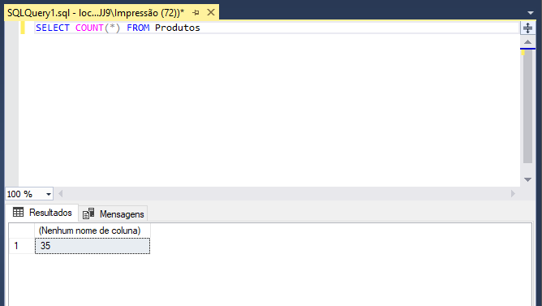
No exemplo acima utilizamos o `COUNT(*)` para que seja retornado apenas a quantidade de linhas contida no banco, neste caso, 35 linhas.

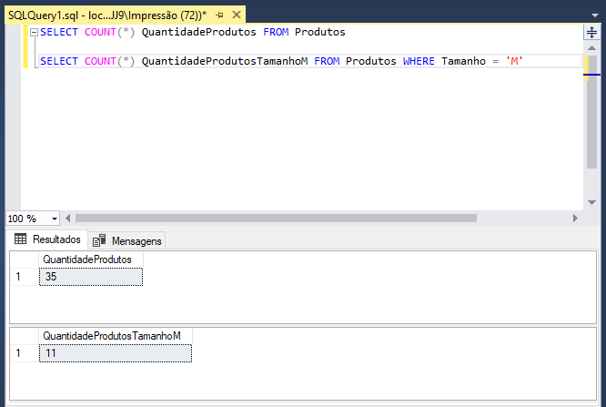
Podemos também dar nome a coluna que retorna para tornar a query mais clara.

##### SUM
A função `SUM` do SQL serve para somar valores numéricos contidos em uma coluna do banco de dados.

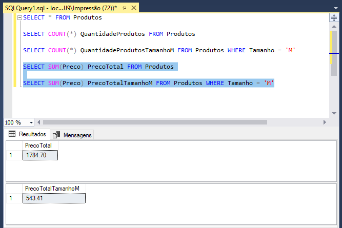
No exemplo acima somamos primeiro os valores de todas as linhas da coluna preço, também fizemos outra query que utiliza o `WHERE` para somar todos os preços de produtos do tamanho M.

##### MIN, MAX e AVG
As funções `MIN MAX AVG` são utilizadas para retornar o menor valor, maior valor e a média de valores contido na tabela.

No exemplo acima temos o maior valor de tamanho M contido na tabela, o menor valor da coluna de preços em geral e a média dos valores de preço.

##### Concatenando Colunas
Em alguns casos queremos que o banco de dos retorne valores de uma coluna concatenados com outra coluna. Podemos utilizar no comando `SELECT` o sinal de concatenação `+` para fazer a junção de dados de diferentes colunas.

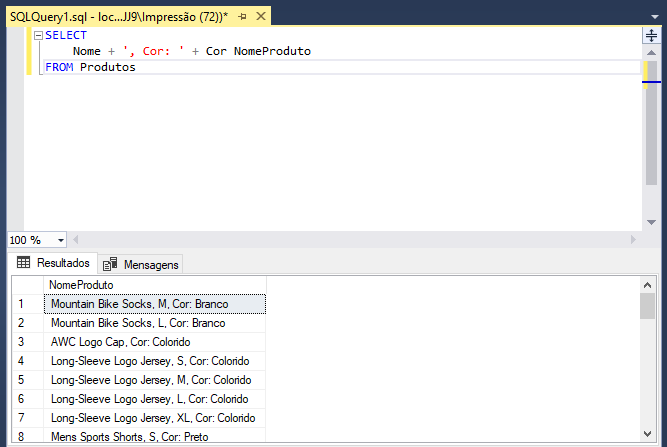
No exemplo acima concatenamos a coluna Nome com a Coluna Cor e um texto entre elas. O retorno foi uma coluna de nome `NomeProduto` com as respectivas colunas concatenadas.

##### Upper e Lower
Podemos fazer tratamentos no texto que é retornado pelo banco de dados utilizando a função `UPPER()` para transformar tudo em maiúsculo e `LOWER()` para transformar tudo em minusculo.

No exemplo acima utilzamos o `UPPER` para retornar dados de nome em maiúsculo e o `LOWER` transformar dados de cor em minúsculo.

##### Adicionando uma nova coluna
Podemos adicionar colunas a uma tabela de duas maneiras. Por meio de script e por meio visual. É recomendável que sempre seja inserido por script.

###### Adicionando coluna de maneira visual

1. Navegue pelo seu banco de dados até a tabela desejada
2. Clique com o botão direito na tabela a ser adicionada a coluna
3. Clique na opção __Design__
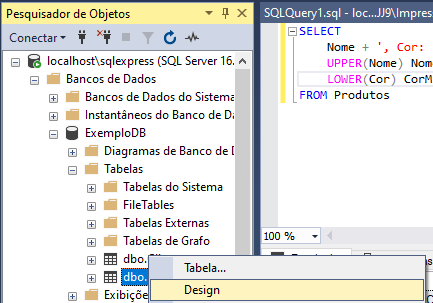
4. Digite o Nome da coluna, seu tipo e se é nullable abaixo da última coluna existente na tabela
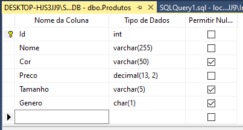
5. Pressione __ctrl + S__ para salvar

__*Para deletar uma coluna*__
1. Clique com o botão direito na setinha preta da coluna a ser deletada
2. Clique em __Excluir Coluna__

3. Pressione __ctrl + S__ para salvar

###### Adicionando coluna por script
Adicionar uma coluna por script é muito simples e requer apenas alguns comandos.
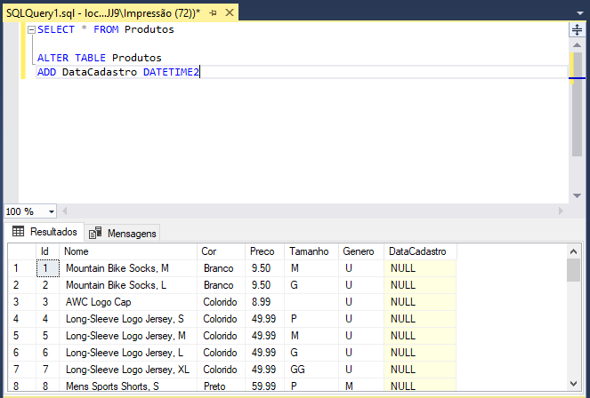
Utilizamos o comando `ALTER TABLE` para indicar que faremos uma alteração na tabela. Em seguida utilizamos o `ADD` seguido do nome da coluna e seu tipo.

__*Para deletar uma coluna*__

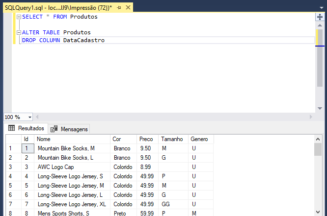
Para deletar uma coluna utilizamos para alterar uma tabela e utilizamos o `DROP COLUMN` seguido do nome da coluna.

##### FORMAT
Podemos utilizar a função `FORMAT()` para formatar dados do tipo `DATETIME` por exemplo.

No exemplo acima formatamos o `DATETIME2` adicionado anteriormente para o padrão brasileiro de data. Agit  função `FORMAT()` recebe a coluna a ser formatada e a formatação desejada como argumento separado por vírgula.
__A sintaxe de formatação é bem parecida com o C#.__