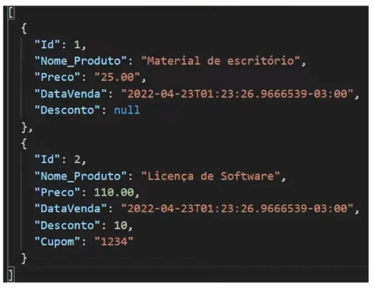

# Programação de APIs com Banco de Dados

## Banco de dados

Um banco de dados é uma coleção organizada de informações (ou dados) estruturadas, normalmente armazenadas eletronicamente em um sistema de computador.

### Tipos de banco de dados

#### Banco de dados relacional

O tipo mais usado atualmente, armazenando dados estruturados, sendo organizado em tabelas, com colunas e linhas, que se relacionam entre si.

A escolha do banco de dados depende diretamente de sua aplicação.
O MySQL é uma solução gratuita que comporta um pequeno volume de acessos, o que faz dele uma solução ideal para pequenas aplicações individuais, porém, quando precisamos de algo mais robusto como um sistema de um hospital do qual não pode haver indisponibilidade, o uso do Oracle ou SQL Server é mais indicado.

##### Tabelas
São dados estruturados e organizados logicamente em formato de linha e coluna.

Assim como uma tabela de excel, tabelas de banco de dados são estruturadas em colunas e linhas. Suas colunas indicam seu tipo de dado e as linhas são o dado em si.
Na imagem acima temos uma relação entre a tabela de endereços na coluna `IdCliente` que se relaciona com a tabela de clientes por meio da coluna `Id`.

#### Banco de dados não relacional
Banco de dados onde os dados não são armazenados em tabela e sim armazenados de maneira não estruturada ou semi-estruturada.

O mongoDB é o banco de dados não relacional mais utilizado e existem vários tipos, sendo alguns deles o document databases(mongoDB), key-value databases, wide-column stores e graph databases.
Um banco de dados relacional tem uma estrutura rígida de armazenamento de dados. Se uma coluna é definida como booleana, ela não pode receber valores inteiros ou de texto por exemplo.

##### Dados semi estruturados
Os banco de dados não relacionais podem utilizar dados semi estruturados para armazenar seus dados.

Neste exemplo temos um arquivo JSON que pode ser uma das estruturas de dados utilizadas em um banco de dados não relacional.
Diferente do banco de dados relacional, a estrutura pode ser variável, contendo dados diferentes e de tipos diferentes.

### Database Management System (DBMS)
É um software utilizado para acessar, manipular e monitorar um sistema de banco de dados.

Um banco de dados funciona de forma stand alone, porém, para que você desenvolvedor manipule o banco de dados, é necessário um software que funciona de forma parecida com uma IDE, mas que é voltada a manipulação de um banco de dados. No caso do SQL server, temos o SQL Server Management Studio.

### Instalação e configuração

#### SQL server

1.  Acesse o site para download do [SQL Server](https://www.microsoft.com/pt-br/sql-server/sql-server-downloads)
2. Procure pela __Edição especializada gratuita__
3. Baixe a versão __Express__
4. Selecione a versão Básica e siga os passos até o fim da instalação

Ao final da instalação será exibida informações úteis para manipulação do banco de dados com o DBMS.
A informação de `CADEIA DE CONEXÃO` será a informação utilizada para conexão com o banco de dados.

#### Server Management Studio (SSMS)

1. Acesse o site para download do [SSMS](https://learn.microsoft.com/pt-br/sql/ssms/download-sql-server-management-studio-ssms?view=sql-server-ver16)
2. Vá a até a sessão __Baixar o SSMS__
3. Clique em __Baixar o SSMS (SQL Server Management Studio)__
4. Siga os passos do instalador